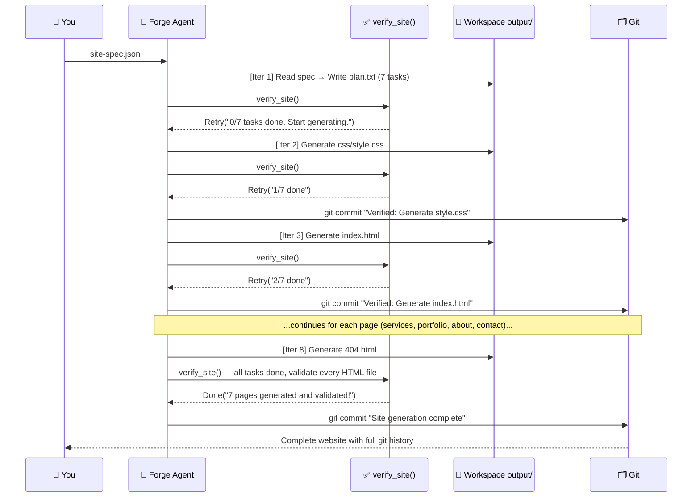
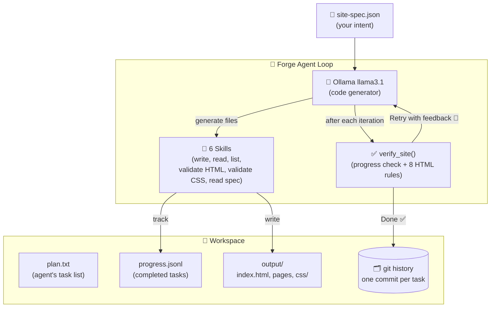
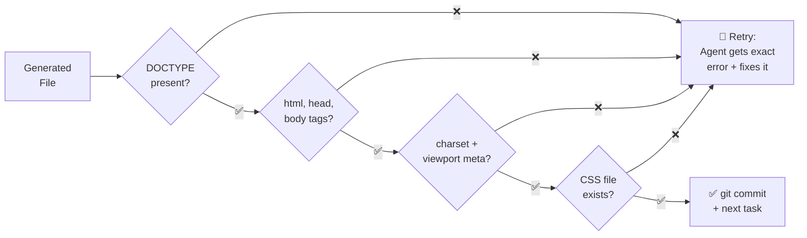

<div align="center">

# NeamForge Site Generator

### Built with Neam's Forge Agent — From JSON Spec to Validated Website, Autonomously

[](https://github.com/neam-lang/neam)
[](https://ollama.com)
[](LICENSE)

> **Describe your website in JSON. The Forge Agent builds every page, validates every file, and commits every step — all autonomously. Zero cloud cost.**

</div>

---

## The Business Problem

Building websites is expensive, slow, and inconsistent. Here's who gets hurt:

| Who's Affected | The Pain |
|---|---|
| Freelancers & small businesses | Wix/Squarespace: $15–$50/month — bloated, slow, no ownership |
| Developers | 8–16 hours of repetitive boilerplate for a 5-page site — doctype, meta tags, nav, footer, responsiveness on every single page |
| Teams using AI code generators | ChatGPT/Copilot: generates one file at a time, **no consistency** — different styles, broken navigation, missing meta tags across pages |
| Anyone shipping fast | Zero quality assurance — broken links, non-responsive layouts, missing accessibility tags only surface after deployment |

---

## How I Solved It with Neam

I used **Neam's Forge Agent** — an iterative build-verify agent type — to create a site generator that:

1. **Reads your intent**: Takes a simple JSON spec describing your pages, theme, and content
2. **Plans the build**: Auto-creates a task list — one task per file to generate
3. **Builds iteratively**: Generates HTML and CSS one task at a time, with fresh context each iteration
4. **Self-validates**: After every file, calls a verify callback that checks 8 HTML quality rules
5. **Self-corrects**: If validation fails, the agent gets the exact error and fixes it automatically
6. **Commits every step**: `checkpoint: "git"` creates a commit after every verified task — full audit trail

**You write ~100 lines of JSON. You get a complete, validated, multi-page website in minutes. For $0.**

---

## How It Works — The Build-Verify Loop



---

## System Architecture



---

## The Verify Callback — Quality Gate

Every generated file passes through **8 HTML checks** before the agent moves on:



If any check fails, the agent receives the **exact error message** and self-corrects. This is the Forge pattern: build → verify → fix → verify again.

---

## Forge Agent vs Claw Agent

This project uses a **Forge Agent** — a fundamentally different agent type:

| Aspect | Claw Agent (Support Bot) | Forge Agent (This Project) |
|---|---|---|
| **Purpose** | Ongoing conversation | Complete a build task with a defined end state |
| **Context per turn** | Accumulates history | Fresh context every iteration |
| **Verify callback** | Not available | Core mechanism — called after every iteration |
| **Git checkpoint** | Not available | Automatic commit per verified task |
| **Loop end condition** | User stops talking | `Done()` signal / budget exhausted |
| **Best for** | Chatbot, assistant | Code generator, builder, automation pipeline |

---

## Input: A Simple JSON Spec

You describe your site in JSON — no HTML knowledge needed:

```json
{
  "site_name": "CloudPeak Studios",
  "tagline": "We build digital experiences",
  "theme": {
    "primary_color": "#3B82F6",
    "font_heading": "Georgia, serif",
    "font_body": "system-ui, sans-serif"
  },
  "pages": [
    {
      "slug": "index",
      "title": "Home",
      "sections": [
        { "type": "hero", "headline": "Build Something Remarkable" },
        { "type": "features", "items": ["Fast", "Responsive", "Accessible"] }
      ]
    },
    { "slug": "about",   "title": "About Us",  "sections": [...] },
    { "slug": "contact", "title": "Contact",   "sections": [...] }
  ]
}
```

**Output**: A complete multi-page website — shared CSS, consistent navigation, validated HTML, full git history.

---

## Supported Section Types

| Section | Description |
|---|---|
| `hero` | Full-width banner with headline + CTA button |
| `features` | Grid of icon cards |
| `stats` | Number showcase row |
| `cards` | Content card grid (services, pricing) |
| `project_grid` | Portfolio cards with tags |
| `team` | Team member cards |
| `contact_info` | Email, phone, address, hours |
| `contact_form` | HTML form with custom fields |
| `text_block` | Paragraph content |

---

## Business Impact

| Metric | Manual Dev | AI One-Shot (ChatGPT) | NeamForge |
|---|---|---|---|
| Time for 5-page site | 8–16 hours | ~1 hour (inconsistent) | **5–15 minutes** |
| Cost | Developer hourly rate | Cloud API cost | **$0** |
| Cross-page consistency | Depends on developer | Often broken | **Guaranteed (shared CSS)** |
| HTML quality validation | Manual testing | None | **Automated (8 checks per file)** |
| Audit trail | Manual git commits | None | **Automatic git per task** |

---

## Quick Start

### Docker (Recommended)

```bash
git clone https://github.com/samsuljahith/neamforge-site-generator.git
cd neamforge-site-generator

docker compose up --build
# Agent starts generating automatically — watch the terminal for progress
# Preview the site: http://localhost:3000

# Generate a different site:
docker compose run site-generator examples/devbrew-blog.json
```

### Local

```bash
git clone https://github.com/samsuljahith/neamforge-site-generator.git
cd neamforge-site-generator

ollama pull llama3.1
chmod +x run.sh

./run.sh                           # CloudPeak Studios (default, 5 pages)
./run.sh examples/devbrew-blog.json  # DevBrew Blog (3 pages)

# Preview
cd workspace/output && python3 -m http.server 3000
```

---

## Generated Output

```
workspace/
├── plan.txt                  # Auto-generated task list (created in iteration 1)
├── progress.jsonl            # Completed task log
├── learnings.jsonl           # Agent insights during generation
├── .git/                     # Full generation history — one commit per task
└── output/
    ├── index.html
    ├── services.html
    ├── portfolio.html
    ├── about.html
    ├── contact.html
    ├── 404.html
    └── css/
        └── style.css
```

View the generation history — every step is a git commit:

```bash
cd workspace && git log --oneline

# a3f2d1c Verified: Generate 404.html
# 8b1e4a9 Verified: Generate contact.html
# f1a9b2e Verified: Generate portfolio.html
# 9e2b5f7 Verified: Generate index.html
# 3a8d1c4 Verified: Generate css/style.css
# 7f6e2b9 Verified: Create plan from site-spec.json
```

---

## Project Structure

```
neamforge-site-generator/
├── site_generator.neam       # Complete agent — 358 lines
├── site-spec.json            # Default spec (CloudPeak Studios — 5 pages)
├── examples/
│   └── devbrew-blog.json     # Alternative spec (DevBrew Blog — 3 pages)
├── run.sh                    # One-command local runner
├── docker-compose.yml        # Ollama + Forge agent + Nginx preview
├── Dockerfile                # Multi-stage build with git
├── nginx.conf                # Preview server config
└── README.md
```

---

## Neam Concepts Demonstrated

| Neam Concept | What It Does in This Project |
|---|---|
| `forge agent` | Iterative build-verify agent type |
| `verify` callback | `verify_site()` — progress check + 8-rule HTML validation |
| `Done(message)` | Signal completion when all pages are validated |
| `Retry(feedback)` | Send specific error back to agent for self-correction |
| `Abort(reason)` | Stop permanently on unrecoverable failure |
| `checkpoint: "git"` | Automatic git commit per verified task |
| `loop` config | `max_iterations: 30`, `max_cost: 0.0` (Ollama is free) |
| `skill` (6 tools) | write_file, read_file, list_files, validate_html, validate_css, read_site_spec |
| `workspace` | Generated site output + tracking files |
| `exec()` | Shell commands for `mkdir`, `find` |
| `plan.txt` | Agent's self-created task list (one task per line) |
| `progress.jsonl` | Completed task log — drives verify progress check |
| `impl Sandboxable` | No network, workspace-only filesystem |
| `impl Monitorable` | Detects stuck agent (5 iterations without progress) |

---

## License

MIT License

---

Built with the [Neam programming language](https://github.com/neam-lang/neam) · Powered by [Ollama](https://ollama.com) · Guided by [Praveen Govindaraj](https://github.com/Praveengovianalytics)
